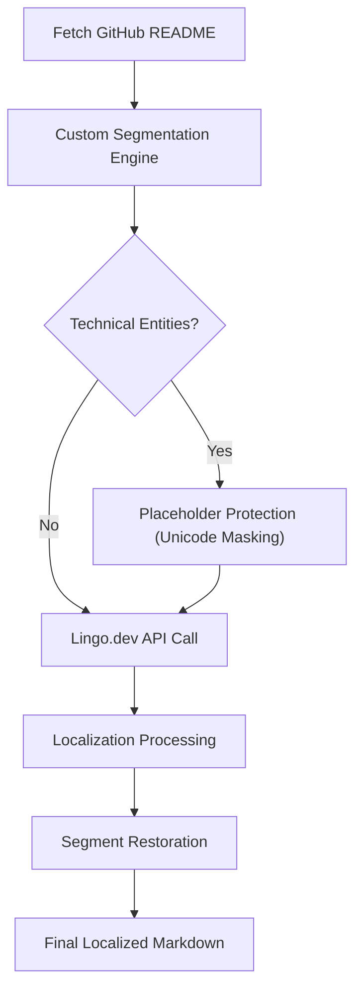

# 🌐 Global README Localizer (GRL)

<div align="center">

> **Effortlessly translate your GitHub documentation into 15+ languages while maintaining 100% technical integrity.**

[](https://react.dev/)
[](https://vitejs.dev/)
[](https://supabase.com/)
[](https://lingo.dev/)
[](LICENSE)

[**Explore Demo**](https://your-demo-link.com) | [**View Roadmap**](#-roadmap) | [**Report Bug**](https://github.com/Pranav99t/readme_localizer/issues)

</div>

---

## ✨ Overview

**Global README Localizer** (GRL) is a premium developer tool designed to break the language barrier in open-source documentation. While code is universal, documentation often remains a hurdle for global contributors. GRL bridges this gap by providing a specialized, developer-first localization engine that respects the technical nuances of Markdown.

### Why GRL? 🚀
- **Technical Integrity**: Unlike standard translators, GRL preserves code blocks, relative links, and image paths.
- **Developer-First UI**: A "Cyber-Obsidian" design system built for power users.
- **Seamless Integration**: Directly connects to your GitHub repositories via official APIs.

---

## 🛠️ Tech Stack

### **Frontend**
*   **React 19**: Utilizing the latest concurrent features for a smooth, app-like experience.
*   **Vite**: For lightning-fast builds and optimized hot module replacement.
*   **Vanilla CSS**: A custom-engineered design system featuring glassmorphism and motion-optimized interactions.

### **Backend & Infrastructure**
*   **Supabase**: Managed PostgreSQL for persistent storage and GoTrue for secure user authentication.
*   **GitHub REST API**: For real-time repository analysis and file fetching.
*   **Local Storage**: Robust architecture with automated state persistence and recovery.

### **Localization Engine**
*   **Lingo.dev**: High-accuracy AI localization SDK tailored for technical documentation.
*   **Custom Segmentation Engine**: Our proprietary logic that "protects" technical entities before translation.

---

## 🚀 Key Features

| Feature | Description |
| :--- | :--- |
| **Instant Repo Parsing** | Analyze and fetch README files directly from any public/private GitHub repo. |
| **Precision Translation** | Lingo.dev powered AI that understands technical context and developer jargon. |
| **Batch Processing** | Select 15+ languages and localize in parallel with real-time progress tracking. |
| **Markdown Protection** | Sophisticated "Fence Protection" ensuring code blocks and URLs remain 100% functional. |
| **Synthesis Dashboard** | A beautiful, glassmorphic UI to manage, view, and export your localized docs. |

---

## ⚙️ How It Works (The Core Logic)



1.  **Ingestion**: GRL fetches the raw Markdown via the GitHub API.
2.  **Segmentation**: Our engine identifies code blocks (```), links `[label](url)`, and images ``.
3.  **Masking**: Technical entities are replaced with unique Unicode placeholders that LLMs ignore.
4.  **Translation**: The "cleaned" prose is sent to **Lingo.dev** for high-fidelity translation.
5.  **Reconstruction**: The original code blocks and links are "stitched" back into the localized text, ensuring zero link breakage.

---

## 🏗️ Getting Started

### Prerequisites
- Node.js (v18 or higher)
- A Lingo.dev API Key
- A Supabase Project (URL and Anon Key)

### Installation
1.  **Clone the Repository**
    ```bash
    git clone https://github.com/Pranav99t/readme_localizer.git
    cd readme_localizer
    ```
2.  **Install Dependencies**
    ```bash
    npm install
    ```
3.  **Environment Variables**
    Create a `.env` file in the root directory:
    ```env
    VITE_SUPABASE_URL=your_supabase_url
    VITE_SUPABASE_ANON_KEY=your_supabase_anon_key
    VITE_LINGO_API_KEY=your_lingo_api_key
    ```
4.  **Run Development Server**
    ```bash
    npm run dev
    ```

---

## 🗺️ Roadmap

- [x] Initial Beta Release (Hackathon 2024)
- [x] Lingo.dev Integration
- [x] Multi-Language Batch Processing
- [ ] Direct "Pull Request" creation back to GitHub
- [ ] Auto-detection of translation-worthy files in a repo
- [ ] Support for non-Markdown documentation (Asciidoc, etc.)

---

## 🤝 Contributing

Contributions are what make the open-source community such an amazing place to learn, inspire, and create. Any contributions you make are **greatly appreciated**.

1. Fork the Project
2. Create your Feature Branch (`git checkout -b feature/AmazingFeature`)
3. Commit your Changes (`git commit -m 'Add some AmazingFeature'`)
4. Push to the Branch (`git push origin feature/AmazingFeature`)
5. Open a Pull Request

---

## 📜 License

Distributed under the MIT License. See `LICENSE` for more information.

---

<div align="center">
Built with ❤️ for a borderless Open Source World.<br>
<b>GRL Team • Hackathon 2024</b>
</div>
